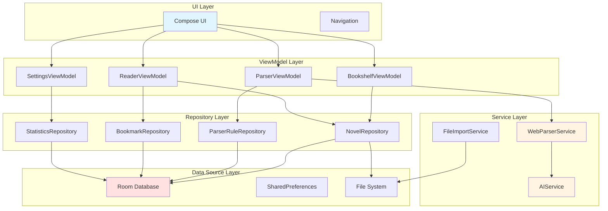

# 设计文档

## 概述

本Android小说阅读器应用采用MVVM（Model-View-ViewModel）架构模式，结合Repository模式实现数据层抽象。应用的核心创新在于智能网站解析引擎和AI摘要生成功能，同时提供完善的本地阅读体验。

### 技术栈

- **开发语言**：Java 21
- **最低SDK版本**：API 24 (Android 7.0)
- **目标SDK版本**：API 34 (Android 14)
- **架构模式**：MVVM + Repository
- **依赖注入**：Hilt (Dagger)
- **异步处理**：RxJava 3 / LiveData
- **数据库**：Room
- **网络请求**：Retrofit + OkHttp
- **HTML解析**：Jsoup
- **UI框架**：传统XML布局 + Material Design 3
- **图表库**：MPAndroidChart（用于阅读统计）

### 核心模块

1. **UI层（Presentation）**：使用传统XML布局构建的用户界面
2. **ViewModel层**：管理UI状态和业务逻辑
3. **Repository层**：数据访问抽象层
4. **数据源层**：本地数据库和远程API
5. **解析引擎**：网站内容提取模块
6. **AI服务**：章节摘要生成模块

## 架构设计

### 整体架构图



### 数据流

1. **用户操作** → UI层接收事件
2. **UI层** → 调用ViewModel方法
3. **ViewModel** → 通过Repository访问数据
4. **Repository** → 协调本地数据库、文件系统、网络服务
5. **数据返回** → Repository → ViewModel → UI（通过StateFlow/LiveData）

### 模块职责

**UI层职责**：
- 渲染界面组件
- 处理用户交互
- 观察ViewModel状态变化
- 导航管理

**ViewModel层职责**：
- 管理UI状态
- 处理业务逻辑
- 协调多个Repository
- 生命周期感知

**Repository层职责**：
- 抽象数据来源
- 缓存策略管理
- 数据转换和映射
- 错误处理

**Service层职责**：
- 网站解析逻辑
- AI API调用
- 文件导入处理
- 后台任务执行

## 组件和接口

### 1. 数据库访问层（DAO）

#### NovelDao
```java
@Dao
public interface NovelDao {
    @Query("SELECT * FROM novels ORDER BY lastReadTime DESC")
    LiveData<List<NovelEntity>> getAllNovels();
    
    @Query("SELECT * FROM novels WHERE id = :novelId")
    NovelEntity getNovelById(long novelId);
    
    @Insert(onConflict = OnConflictStrategy.REPLACE)
    long insertNovel(NovelEntity novel);
    
    @Update
    void updateNovel(NovelEntity novel);
    
    @Delete
    void deleteNovel(NovelEntity novel);
    
    @Query("SELECT * FROM novels WHERE title LIKE '%' || :keyword || '%' OR author LIKE '%' || :keyword || '%'")
    LiveData<List<NovelEntity>> searchNovels(String keyword);
}
```

#### ChapterDao
```java
@Dao
public interface ChapterDao {
    @Query("SELECT * FROM chapters WHERE novelId = :novelId ORDER BY chapterIndex")
    LiveData<List<ChapterEntity>> getChaptersByNovelId(long novelId);
    
    @Query("SELECT * FROM chapters WHERE id = :chapterId")
    ChapterEntity getChapterById(long chapterId);
    
    @Insert(onConflict = OnConflictStrategy.REPLACE)
    void insertChapters(List<ChapterEntity> chapters);
    
    @Query("DELETE FROM chapters WHERE novelId = :novelId")
    void deleteChaptersByNovelId(long novelId);
    
    @Query("SELECT * FROM chapters WHERE novelId = :novelId AND content LIKE '%' || :keyword || '%'")
    List<ChapterEntity> searchInChapters(long novelId, String keyword);
}
```

#### BookmarkDao
```java
@Dao
public interface BookmarkDao {
    @Query("SELECT * FROM bookmarks WHERE novelId = :novelId ORDER BY createTime DESC")
    LiveData<List<BookmarkEntity>> getBookmarksByNovelId(long novelId);
    
    @Insert
    long insertBookmark(BookmarkEntity bookmark);
    
    @Delete
    void deleteBookmark(BookmarkEntity bookmark);
    
    @Query("DELETE FROM bookmarks WHERE novelId = :novelId")
    void deleteBookmarksByNovelId(long novelId);
}
```

#### ParserRuleDao
```java
@Dao
public interface ParserRuleDao {
    @Query("SELECT * FROM parser_rules")
    LiveData<List<ParserRuleEntity>> getAllRules();
    
    @Query("SELECT * FROM parser_rules WHERE domain = :domain")
    ParserRuleEntity getRuleByDomain(String domain);
    
    @Insert(onConflict = OnConflictStrategy.REPLACE)
    long insertRule(ParserRuleEntity rule);
    
    @Delete
    void deleteRule(ParserRuleEntity rule);
}
```

#### ReadingStatisticsDao
```java
@Dao
public interface ReadingStatisticsDao {
    @Query("SELECT * FROM reading_statistics WHERE date BETWEEN :startDate AND :endDate ORDER BY date DESC")
    LiveData<List<ReadingStatisticsEntity>> getStatisticsByDateRange(long startDate, long endDate);
    
    @Insert(onConflict = OnConflictStrategy.REPLACE)
    void insertStatistics(ReadingStatisticsEntity statistics);
    
    @Query("SELECT SUM(readingDuration) FROM reading_statistics WHERE date BETWEEN :startDate AND :endDate")
    Long getTotalReadingDuration(long startDate, long endDate);
    
    @Query("SELECT SUM(readingCharCount) FROM reading_statistics WHERE date BETWEEN :startDate AND :endDate")
    Long getTotalReadingCharCount(long startDate, long endDate);
}
```

#### BlockedWordDao
```java
@Dao
public interface BlockedWordDao {
    @Query("SELECT * FROM blocked_words ORDER BY createTime DESC")
    LiveData<List<BlockedWordEntity>> getAllBlockedWords();
    
    @Insert
    long insertBlockedWord(BlockedWordEntity word);
    
    @Delete
    void deleteBlockedWord(BlockedWordEntity word);
    
    @Query("DELETE FROM blocked_words")
    void deleteAllBlockedWords();
}
```

### 2. Repository接口

#### NovelRepository
```java
public interface NovelRepository {
    LiveData<List<Novel>> getAllNovels();
    Novel getNovelById(long novelId);
    long insertNovel(Novel novel);
    void updateNovel(Novel novel);
    void deleteNovel(long novelId);
    LiveData<List<Novel>> searchNovels(String keyword);
    
    LiveData<List<Chapter>> getChaptersByNovelId(long novelId);
    Chapter getChapterById(long chapterId);
    void insertChapters(long novelId, List<Chapter> chapters);
    void updateReadingProgress(long novelId, long chapterId, int position);
    
    List<SearchResult> searchInNovel(long novelId, String keyword);
    String getFilteredChapterContent(long chapterId, List<String> blockedWords);
}
```

#### FileImportRepository
```java
public interface FileImportRepository {
    Single<Novel> importTxtFile(Uri uri);
    Single<Novel> importEpubFile(Uri uri);
}
```

#### WebParserRepository
```java
public interface WebParserRepository {
    Single<NovelMetadata> parseNovelMetadata(String url, ParserRule rule);
    Single<List<ChapterInfo>> parseChapterList(String url, ParserRule rule);
    Single<String> parseChapterContent(String url, ParserRule rule);
    Single<Novel> downloadNovel(String url, ParserRule rule, ProgressCallback callback);
    
    interface ProgressCallback {
        void onProgress(int current, int total);
    }
}
```

#### ParserRuleRepository
```java
public interface ParserRuleRepository {
    LiveData<List<ParserRule>> getAllRules();
    ParserRule getRuleByDomain(String domain);
    long insertRule(ParserRule rule);
    void deleteRule(long ruleId);
    Single<TestResult> testRule(ParserRule rule, String testUrl);
}
```

#### BookmarkRepository
```java
public interface BookmarkRepository {
    LiveData<List<Bookmark>> getBookmarksByNovelId(long novelId);
    long insertBookmark(Bookmark bookmark);
    void deleteBookmark(long bookmarkId);
}
```

#### AIServiceRepository
```java
public interface AIServiceRepository {
    Single<String> generateSummary(String chapterContent);
    Single<Map<Long, String>> batchGenerateSummaries(List<Chapter> chapters, ProgressCallback callback);
    String getCachedSummary(long chapterId);
    void saveSummaryCache(long chapterId, String summary);
    
    interface ProgressCallback {
        void onProgress(int current, int total);
    }
}
```

#### StatisticsRepository
```java
public interface StatisticsRepository {
    void recordReadingSession(long novelId, long duration, int charCount);
    LiveData<List<ReadingStatistics>> getStatisticsByPeriod(StatisticsPeriod period);
    long getTotalReadingDuration(StatisticsPeriod period);
    long getTotalReadingCharCount(StatisticsPeriod period);
    List<NovelReadingStats> getMostReadNovels(int limit);
}
```

#### BlockedWordRepository
```java
public interface BlockedWordRepository {
    LiveData<List<BlockedWord>> getAllBlockedWords();
    long insertBlockedWord(String word);
    void deleteBlockedWord(long wordId);
    String applyBlockedWords(String text, List<String> blockedWords);
}
```

#### TTSRepository
```java
public interface TTSRepository {
    void startReading(String text, int startPosition);
    void pauseReading();
    void resumeReading();
    void stopReading();
    void setSpeechRate(float rate);
    void setVoice(String voiceId);
    LiveData<TTSState> getTTSState();
    LiveData<Integer> getCurrentPosition();
    List<VoiceInfo> getAvailableVoices();
}
```

### 3. Service接口

#### TTSService
```java
public interface TTSService {
    void initialize(Context context, TTSCallback callback);
    void speak(String text, int startPosition);
    void pause();
    void resume();
    void stop();
    void setSpeechRate(float rate);
    void setVoice(String voiceId);
    List<VoiceInfo> getAvailableVoices();
    boolean isInitialized();
    void shutdown();
    
    interface TTSCallback {
        void onStart();
        void onProgress(int position);
        void onComplete();
        void onError(String error);
    }
}
```

#### WebParserService
```java
public interface WebParserService {
    Single<String> fetchHtml(String url);
    NovelMetadata extractNovelInfo(String html, ParserRule rule);
    List<ChapterInfo> extractChapterList(String html, ParserRule rule);
    String extractChapterContent(String html, ParserRule rule);
    String cleanContent(String content);
}
```

#### AIService
```java
public interface AIService {
    Single<String> callAIApi(String prompt, String content);
    String buildSummaryPrompt(String chapterContent);
}
```

#### FileParserService
```java
public interface FileParserService {
    Single<ParsedNovel> parseTxtFile(Uri uri);
    Single<ParsedNovel> parseEpubFile(Uri uri);
}
```

## 数据模型

### 实体类（Entity - 数据库表）

#### NovelEntity
```java
@Entity(tableName = "novels")
public class NovelEntity {
    @PrimaryKey(autoGenerate = true)
    private long id;
    
    @NonNull
    private String title;
    
    @NonNull
    private String author;
    
    private String description;
    private String coverPath;
    
    @NonNull
    private String source; // "local" or "web"
    
    private String sourceUrl;
    private int totalChapters;
    private Long currentChapterId;
    private int currentPosition;
    private long lastReadTime;
    private long createTime;
    
    @NonNull
    private String category;
    
    private boolean isPinned;
    
    // Constructors, getters, and setters
    public NovelEntity(@NonNull String title, @NonNull String author) {
        this.title = title;
        this.author = author;
        this.description = "";
        this.source = "local";
        this.lastReadTime = System.currentTimeMillis();
        this.createTime = System.currentTimeMillis();
        this.category = "未分类";
        this.isPinned = false;
    }
    
    // Getters and Setters omitted for brevity
}
```

#### ChapterEntity
```java
@Entity(
    tableName = "chapters",
    foreignKeys = @ForeignKey(
        entity = NovelEntity.class,
        parentColumns = "id",
        childColumns = "novelId",
        onDelete = ForeignKey.CASCADE
    ),
    indices = {@Index("novelId"), @Index("chapterIndex")}
)
public class ChapterEntity {
    @PrimaryKey(autoGenerate = true)
    private long id;
    
    private long novelId;
    
    @NonNull
    private String title;
    
    @NonNull
    private String content;
    
    private int chapterIndex;
    private int wordCount;
    private String sourceUrl;
    private String summary;
    private long createTime;
    
    // Constructors, getters, and setters omitted for brevity
}
```

#### BookmarkEntity
```java
@Entity(
    tableName = "bookmarks",
    foreignKeys = @ForeignKey(
        entity = NovelEntity.class,
        parentColumns = "id",
        childColumns = "novelId",
        onDelete = ForeignKey.CASCADE
    ),
    indices = @Index("novelId")
)
public class BookmarkEntity {
    @PrimaryKey(autoGenerate = true)
    private long id;
    
    private long novelId;
    private long chapterId;
    
    @NonNull
    private String chapterTitle;
    
    private int position;
    private String note;
    private long createTime;
    
    // Constructors, getters, and setters omitted for brevity
}
```

#### ParserRuleEntity
```java
@Entity(tableName = "parser_rules")
public class ParserRuleEntity {
    @PrimaryKey(autoGenerate = true)
    private long id;
    
    @NonNull
    private String name;
    
    @NonNull
    private String domain;
    
    @NonNull
    private String chapterListSelector;
    
    @NonNull
    private String chapterTitleSelector;
    
    @NonNull
    private String chapterLinkSelector;
    
    @NonNull
    private String contentSelector;
    
    private String removeSelectors; // 逗号分隔的选择器列表
    private long createTime;
    
    // Constructors, getters, and setters omitted for brevity
}
```

#### ReadingStatisticsEntity
```java
@Entity(tableName = "reading_statistics")
public class ReadingStatisticsEntity {
    @PrimaryKey(autoGenerate = true)
    private long id;
    
    private long date; // 日期时间戳（精确到天）
    private long novelId;
    private long readingDuration; // 阅读时长（毫秒）
    private int readingCharCount; // 阅读字数
    private int hourOfDay; // 阅读时段（0-23）
    
    // Constructors, getters, and setters omitted for brevity
}
```

#### BlockedWordEntity
```java
@Entity(tableName = "blocked_words")
public class BlockedWordEntity {
    @PrimaryKey(autoGenerate = true)
    private long id;
    
    @NonNull
    private String word;
    
    private long createTime;
    
    // Constructors, getters, and setters omitted for brevity
}
```

### 领域模型（Domain Model）

#### Novel
```java
public class Novel {
    private long id;
    private String title;
    private String author;
    private String description;
    private String coverPath;
    private NovelSource source;
    private String sourceUrl;
    private int totalChapters;
    private Chapter currentChapter;
    private int currentPosition;
    private long lastReadTime;
    private long createTime;
    private String category;
    private boolean isPinned;
    private float readingProgress; // 0.0 - 1.0
    
    // Constructors, getters, and setters omitted for brevity
}

public enum NovelSource {
    LOCAL, WEB
}
```

#### Chapter
```java
public class Chapter {
    private long id;
    private long novelId;
    private String title;
    private String content;
    private int chapterIndex;
    private int wordCount;
    private String sourceUrl;
    private String summary;
    private long createTime;
    
    // Constructors, getters, and setters omitted for brevity
}
```

#### Bookmark
```java
public class Bookmark {
    private long id;
    private long novelId;
    private long chapterId;
    private String chapterTitle;
    private int position;
    private String note;
    private long createTime;
    
    // Constructors, getters, and setters omitted for brevity
}
```

#### ParserRule
```java
public class ParserRule {
    private long id;
    private String name;
    private String domain;
    private String chapterListSelector;
    private String chapterTitleSelector;
    private String chapterLinkSelector;
    private String contentSelector;
    private List<String> removeSelectors;
    private long createTime;
    
    // Constructors, getters, and setters omitted for brevity
}
```

#### SearchResult
```java
public class SearchResult {
    private long chapterId;
    private String chapterTitle;
    private int chapterIndex;
    private int position;
    private String preview; // 包含关键词的上下文预览
    private String keyword;
    
    // Constructors, getters, and setters omitted for brevity
}
```

#### ReadingStatistics
```java
public class ReadingStatistics {
    private long date;
    private long totalDuration;
    private int totalCharCount;
    private Map<Integer, Long> hourDistribution; // 时段 -> 阅读时长
    
    // Constructors, getters, and setters omitted for brevity
}

public enum StatisticsPeriod {
    DAY, WEEK, MONTH
}

#### TTSState
```java
public class TTSState {
    private boolean isPlaying;
    private boolean isPaused;
    private float speechRate;
    private String currentVoiceId;
    private int currentPosition;
    private long currentChapterId;
    
    // Constructors, getters, and setters omitted for brevity
}

public enum TTSStatus {
    IDLE, PLAYING, PAUSED, ERROR
}
```

#### VoiceInfo
```java
public class VoiceInfo {
    private String voiceId;
    private String name;
    private String language;
    private boolean isDefault;
    
    // Constructors, getters, and setters omitted for brevity
}
```
```

#### BlockedWord
```java
public class BlockedWord {
    private long id;
    private String word;
    private long createTime;
    
    // Constructors, getters, and setters omitted for brevity
}
```

### UI状态模型

#### BookshelfUiState
```java
public class BookshelfUiState {
    private List<Novel> novels;
    private boolean isLoading;
    private String error;
    private String searchQuery;
    private String selectedCategory;
    
    public BookshelfUiState() {
        this.novels = new ArrayList<>();
        this.isLoading = false;
        this.error = null;
        this.searchQuery = "";
        this.selectedCategory = "全部";
    }
    
    // Getters and setters omitted for brevity
}
```

#### ReaderUiState
```java
public class ReaderUiState {
    private Novel novel;
    private Chapter currentChapter;
    private List<Chapter> chapters;
    private String displayContent;
    private boolean isLoading;
    private String error;
    private boolean showToolbar;
    private float fontSize;
    private float lineSpacing;
    private ReaderTheme theme;
    private List<SearchResult> searchResults;
    private int currentSearchIndex;
    private ReadingPosition savedPosition;
    
    public ReaderUiState() {
        this.chapters = new ArrayList<>();
        this.displayContent = "";
        this.isLoading = false;
        this.error = null;
        this.showToolbar = false;
        this.fontSize = 18f;
        this.lineSpacing = 1.5f;
        this.theme = ReaderTheme.DAY;
        this.searchResults = new ArrayList<>();
        this.currentSearchIndex = -1;
    }
    
    // Getters and setters omitted for brevity
}

public class ReadingPosition {
    private long chapterId;
    private int position;
    
    // Constructor, getters, and setters omitted for brevity
}

public class ReaderTheme {
    private String name;
    private int backgroundColor;
    private int textColor;
    
    public static final ReaderTheme DAY = new ReaderTheme("日间", Color.WHITE, Color.BLACK);
    public static final ReaderTheme NIGHT = new ReaderTheme("夜间", 0xFF1E1E1E, 0xFFE0E0E0);
    public static final ReaderTheme EYE_CARE = new ReaderTheme("护眼", 0xFFC7EDCC, 0xFF333333);
    
    // Constructor, getters, and setters omitted for brevity
}
```

#### ParserUiState
```java
public class ParserUiState {
    private String url;
    private ParserRule selectedRule;
    private NovelMetadata novelMetadata;
    private List<ChapterInfo> chapters;
    private DownloadProgress downloadProgress;
    private boolean isLoading;
    private String error;
    
    public ParserUiState() {
        this.url = "";
        this.chapters = new ArrayList<>();
        this.isLoading = false;
        this.error = null;
    }
    
    // Getters and setters omitted for brevity
}

public class NovelMetadata {
    private String title;
    private String author;
    private String description;
    
    // Constructor, getters, and setters omitted for brevity
}

public class ChapterInfo {
    private String title;
    private String url;
    
    // Constructor, getters, and setters omitted for brevity
}

public class DownloadProgress {
    private int current;
    private int total;
    private String currentChapterTitle;
    
    // Constructor, getters, and setters omitted for brevity
}
```

## 正确性属性


*属性是一个特征或行为，应该在系统的所有有效执行中保持为真——本质上是关于系统应该做什么的正式陈述。属性作为人类可读规范和机器可验证正确性保证之间的桥梁。*

基于需求文档中的验收标准，我们定义以下正确性属性：

### 属性 1：TXT文件解析完整性
*对于任何*有效的TXT格式文件，解析后创建的小说条目应包含从文件中提取的完整内容，且章节数量应大于0
**验证需求：1.2**

### 属性 2：EPUB文件章节提取正确性
*对于任何*有效的EPUB格式文件，提取的章节列表应与EPUB内部目录结构一致，且每个章节都应包含标题和内容
**验证需求：1.3**

### 属性 3：文件导入错误处理
*对于任何*损坏的或不支持格式的文件，导入操作应返回错误结果而不是崩溃或产生不完整数据
**验证需求：1.4**

### 属性 4：导入后书架一致性
*对于任何*成功导入的小说，书架中应能查询到该小说，且小说ID应存在于数据库中
**验证需求：1.5**

### 属性 5：URL格式验证正确性
*对于任何*输入的字符串，URL验证函数应正确识别有效和无效的URL格式
**验证需求：2.1**

### 属性 6：网页元数据提取完整性
*对于任何*包含小说信息的HTML页面和对应的解析规则，提取的元数据应包含标题、作者和简介字段
**验证需求：2.2**

### 属性 7：章节列表提取完整性
*对于任何*包含章节列表的HTML页面和对应的解析规则，提取的章节数量应与页面中实际章节数量一致
**验证需求：2.3**

### 属性 8：章节下载顺序性
*对于任何*章节下载任务，下载完成后保存的章节索引应按递增顺序排列
**验证需求：2.4**

### 属性 9：断点续传一致性
*对于任何*中断的下载任务，恢复后应从上次中断的章节继续，不应重复下载已完成的章节
**验证需求：2.5**

### 属性 10：内容过滤正确性
*对于任何*包含广告标签的HTML内容和对应的移除选择器列表，过滤后的内容应不包含这些标签
**验证需求：2.6**

### 属性 11：解析后数据持久化
*对于任何*解析完成的小说，数据库中应存在该小说记录及其所有章节记录
**验证需求：2.7**

### 属性 12：解析规则验证完整性
*对于任何*解析规则，当且仅当所有必需字段（域名、章节列表选择器、内容选择器）都非空时，验证应通过
**验证需求：3.3**

### 属性 13：不完整规则拒绝
*对于任何*缺少必需字段的解析规则，保存操作应失败并返回缺失字段的信息
**验证需求：3.4**

### 属性 14：规则测试结果正确性
*对于任何*解析规则和测试URL，测试结果应包含使用该规则从URL提取的实际内容
**验证需求：3.5**

### 属性 15：规则删除一致性
*对于任何*被删除的解析规则，删除后数据库中不应存在该规则ID的记录
**验证需求：3.6**

### 属性 16：小说条目显示完整性
*对于任何*小说条目的渲染结果，应包含标题、作者、阅读进度这些必需信息
**验证需求：4.2**

### 属性 17：小说删除级联性
*对于任何*被删除的小说，删除后数据库中不应存在该小说ID的记录，也不应存在关联的章节记录
**验证需求：4.4**

### 属性 18：小说搜索准确性
*对于任何*搜索关键词，返回的小说列表中每本小说的标题或作者应包含该关键词
**验证需求：4.5**

### 属性 19：分类筛选准确性
*对于任何*分类名称，筛选结果中的所有小说的分类字段应等于该分类名称
**验证需求：4.6**

### 属性 20：阅读进度恢复正确性
*对于任何*小说，打开时显示的章节ID应与数据库中保存的当前章节ID一致
**验证需求：5.1**

### 属性 21：字体大小应用即时性
*对于任何*字体大小调整操作，调整后阅读器状态中的字体大小应等于设置的值
**验证需求：5.4**

### 属性 22：行间距应用即时性
*对于任何*行间距调整操作，调整后阅读器状态中的行间距应等于设置的值
**验证需求：5.5**

### 属性 23：章节切换一致性
*对于任何*章节切换操作，切换后显示的章节内容应与目标章节ID对应的章节内容一致，且阅读进度应更新为该章节
**验证需求：5.6**

### 属性 24：阅读位置保存正确性
*对于任何*退出阅读操作，退出后数据库中保存的阅读位置应与退出时的章节ID和位置一致
**验证需求：5.7**

### 属性 25：主题应用正确性
*对于任何*主题选择操作，应用后阅读器的背景色和文字色应与该主题定义的颜色一致
**验证需求：6.2**

### 属性 26：自定义主题持久化
*对于任何*保存的自定义主题，保存后主题列表中应包含该主题，且主题的颜色配置应与保存时一致
**验证需求：6.5**

### 属性 27：自动主题切换正确性
*对于任何*启用自动切换的情况，当系统时间在夜间时段（如22:00-6:00）时，应用的主题应为夜间模式
**验证需求：6.6**

### 属性 28：书签保存完整性
*对于任何*书签添加操作，保存的书签应包含当前章节ID、位置和用户输入的备注
**验证需求：7.1, 7.2**

### 属性 29：书签跳转准确性
*对于任何*书签跳转操作，跳转后阅读器显示的章节ID和位置应与书签记录的一致
**验证需求：7.4**

### 属性 30：书签删除一致性
*对于任何*被删除的书签，删除后数据库中不应存在该书签ID的记录
**验证需求：7.5**

### 属性 31：AI摘要API调用正确性
*对于任何*摘要生成请求，调用AI API时传递的内容应与请求的章节内容一致
**验证需求：8.1**

### 属性 32：AI摘要缓存正确性
*对于任何*AI服务返回的摘要，保存后数据库中对应章节的摘要字段应与返回的摘要内容一致
**验证需求：8.2**

### 属性 33：AI服务错误处理
*对于任何*AI服务调用失败的情况，应返回错误结果而不是空摘要或崩溃
**验证需求：8.3**

### 属性 34：摘要缓存命中避免重复调用
*对于任何*已有缓存摘要的章节，请求摘要时应直接返回缓存内容，不应发起新的API调用
**验证需求：8.4**

### 属性 35：批量摘要生成顺序性
*对于任何*批量摘要生成任务，处理的章节顺序应与输入的章节列表顺序一致
**验证需求：8.5**

### 属性 36：API超时处理正确性
*对于任何*超过30秒未响应的AI API调用，应终止请求并返回超时错误
**验证需求：8.6**

### 属性 37：关键词搜索完整性
*对于任何*搜索关键词，返回的搜索结果中每个结果的章节内容应包含该关键词
**验证需求：9.2**

### 属性 38：搜索结果列表完整性
*对于任何*搜索操作，结果列表应包含所有包含关键词的章节位置，不应遗漏任何匹配
**验证需求：9.3**

### 属性 39：搜索结果跳转准确性
*对于任何*搜索结果跳转操作，跳转后阅读器显示的位置应包含搜索的关键词
**验证需求：9.4**

### 属性 40：搜索返回位置恢复
*对于任何*从搜索结果返回的操作，返回后阅读器的章节ID和位置应与搜索前保存的位置一致
**验证需求：9.5**

### 属性 41：搜索结果导航正确性
*对于任何*搜索结果导航操作（上一个/下一个），导航后的结果索引应按预期递增或递减
**验证需求：9.7**

### 属性 42：屏蔽词添加持久化
*对于任何*添加的屏蔽词，添加后数据库中应存在该屏蔽词的记录
**验证需求：10.2**

### 属性 43：屏蔽词删除一致性
*对于任何*被删除的屏蔽词，删除后数据库中不应存在该屏蔽词ID的记录
**验证需求：10.3**

### 属性 44：屏蔽词替换正确性
*对于任何*包含屏蔽词的文本和屏蔽词列表，替换后的文本中所有屏蔽词应被替换为星号，且不应包含原始屏蔽词
**验证需求：10.4**

### 属性 45：屏蔽词设置即时生效
*对于任何*屏蔽词列表修改操作，修改后显示的章节内容应应用新的屏蔽词列表
**验证需求：11.5**

### 属性 46：TTS启动正确性
*对于任何*语音朗读启动操作，TTS引擎应开始朗读当前章节内容，且状态应变为播放中
**验证需求：10.1**

### 属性 47：TTS暂停恢复一致性
*对于任何*暂停后恢复的朗读操作，恢复后应从暂停位置继续朗读，不应重新开始
**验证需求：10.6, 10.7**

### 属性 48：TTS语速应用即时性
*对于任何*语速调整操作，调整后TTS引擎的语速应等于设置的值
**验证需求：10.3**

### 属性 49：TTS章节自动切换
*对于任何*章节朗读完成事件，应自动开始朗读下一章节（如果存在）
**验证需求：10.5**

### 属性 50：阅读时长记录正确性
*对于任何*阅读会话，结束后数据库中应存在该会话的时长记录，且时长应大于0
**验证需求：12.1**

### 属性 51：阅读排行计算正确性
*对于任何*阅读统计数据，阅读最多的小说排行应按总阅读时长降序排列
**验证需求：12.5**

### 属性 52：统计周期筛选正确性
*对于任何*统计周期（日/周/月），返回的统计数据的日期应在该周期的时间范围内
**验证需求：12.6**

### 属性 53：小说导入数据完整性
*对于任何*导入的小说，数据库中应存在该小说的元数据记录和所有章节的内容记录
**验证需求：13.2**

### 属性 54：阅读进度更新即时性
*对于任何*阅读进度修改操作，修改后数据库中的进度记录应立即反映新的值
**验证需求：13.3**

### 属性 55：设置持久化正确性
*对于任何*设置修改操作，修改后SharedPreferences中应存在该设置的键值对，且值应与设置的一致
**验证需求：13.4**

### 属性 56：异常退出数据完整性
*对于任何*模拟的异常退出场景，重启后数据库中的数据应完整且可正常查询
**验证需求：13.5**

### 属性 57：缓存清理选择性
*对于任何*缓存清理操作，清理后核心数据（小说、章节、书签）应仍然存在于数据库中
**验证需求：13.6**

### 属性 58：网络请求前状态检查
*对于任何*网络请求操作，发起前应检查网络连接状态
**验证需求：14.1**

### 属性 59：无网络错误处理
*对于任何*网络不可用的情况，网络请求应返回错误结果而不是挂起或崩溃
**验证需求：14.2**

### 属性 60：网络请求超时处理
*对于任何*超过15秒未响应的网络请求，应终止请求并返回超时错误
**验证需求：14.3**

### 属性 61：HTTP错误状态码处理
*对于任何*返回错误状态码（4xx, 5xx）的网络请求，应返回包含状态码信息的错误结果
**验证需求：14.4**

### 属性 62：并发请求数量限制
*对于任何*批量下载任务，同时进行的网络请求数量应不超过预设的并发限制（如5个）
**验证需求：14.5**

### 属性 63：下载任务取消完整性
*对于任何*取消的下载任务，取消后不应有新的章节下载请求发起
**验证需求：14.6**

## 错误处理

### 错误类型定义

```java
public abstract class AppError extends Exception {
    public AppError(String message) {
        super(message);
    }
    
    public AppError(String message, Throwable cause) {
        super(message, cause);
    }
    
    public static class NetworkError extends AppError {
        public NetworkError(String message) {
            super(message);
        }
        
        public NetworkError(String message, Throwable cause) {
            super(message, cause);
        }
    }
    
    public static class ParseError extends AppError {
        private String url;
        
        public ParseError(String message, String url) {
            super(message);
            this.url = url;
        }
        
        public String getUrl() {
            return url;
        }
    }
    
    public static class DatabaseError extends AppError {
        public DatabaseError(String message, Throwable cause) {
            super(message, cause);
        }
    }
    
    public static class FileError extends AppError {
        private String path;
        
        public FileError(String message, String path) {
            super(message);
            this.path = path;
        }
        
        public String getPath() {
            return path;
        }
    }
    
    public static class ValidationError extends AppError {
        private String field;
        
        public ValidationError(String message, String field) {
            super(message);
            this.field = field;
        }
        
        public String getField() {
            return field;
        }
    }
    
    public static class AIServiceError extends AppError {
        private boolean isTimeout;
        
        public AIServiceError(String message, boolean isTimeout) {
            super(message);
            this.isTimeout = isTimeout;
        }
        
        public boolean isTimeout() {
            return isTimeout;
        }
    }
    
    public static class UnknownError extends AppError {
        public UnknownError(String message, Throwable cause) {
            super(message, cause);
        }
    }
}
```

### 错误处理策略

1. **网络错误**
   - 检查网络连接状态
   - 超时设置：普通请求15秒，AI请求30秒
   - 支持重试机制（最多3次）
   - 断点续传支持

2. **解析错误**
   - 验证HTML结构
   - 提供详细的错误信息（哪个选择器失败）
   - 允许用户调整解析规则重试

3. **数据库错误**
   - 使用事务保证数据一致性
   - 异常时回滚操作
   - 记录错误日志

4. **文件错误**
   - 验证文件格式
   - 检查文件权限
   - 处理文件损坏情况

5. **AI服务错误**
   - 超时处理
   - API限流处理
   - 降级策略（显示"摘要生成失败"）

### 错误传播

使用RxJava的错误处理机制封装可能失败的操作：

```java
public Single<Novel> importTxtFile(Uri uri) {
    return fileParserService.parseTxtFile(uri)
        .flatMap(novel -> {
            novelRepository.insertNovel(novel);
            return Single.just(novel);
        })
        .onErrorResumeNext(error -> {
            return Single.error(new AppError.FileError("导入TXT文件失败", uri.toString()));
        });
}
```

## 测试策略

### 单元测试

使用JUnit 5和Mockito进行单元测试：

**测试范围**：
- Repository实现类
- ViewModel业务逻辑
- 数据转换函数
- 工具类函数

**示例**：
```java
@Test
public void testNovelSearchReturnsMatchingResults() {
    // Given
    List<Novel> novels = Arrays.asList(
        new Novel(1, "三体", "刘慈欣"),
        new Novel(2, "流浪地球", "刘慈欣"),
        new Novel(3, "球状闪电", "刘慈欣")
    );
    
    List<Novel> expected = novels.stream()
        .filter(n -> n.getTitle().contains("三体"))
        .collect(Collectors.toList());
    
    when(novelDao.searchNovels("三体")).thenReturn(new MutableLiveData<>(expected));
    
    // When
    LiveData<List<Novel>> results = repository.searchNovels("三体");
    
    // Then
    assertEquals(1, results.getValue().size());
    assertEquals("三体", results.getValue().get(0).getTitle());
}
```

### 属性测试

使用jqwik进行属性测试，每个测试运行至少100次迭代：

**测试库**：jqwik (Java Property Testing)

**测试范围**：
- 所有在正确性属性部分定义的属性
- 数据验证逻辑
- 解析引擎
- 文本处理函数

**示例**：
```java
@Property
public void blockedWordReplacementCorrectness(
    @ForAll String text,
    @ForAll List<@StringLength(min = 1, max = 10) String> blockedWords
) {
    // **Feature: novel-reader-app, Property 44: 屏蔽词替换正确性**
    String result = blockedWordRepository.applyBlockedWords(text, blockedWords);
    
    // 验证所有屏蔽词都被替换
    for (String word : blockedWords) {
        if (!word.isEmpty()) {
            assertFalse(result.contains(word), 
                "Result should not contain blocked word: " + word);
        }
    }
}
```

**属性测试配置**：
- 最小迭代次数：100次（使用@Property(tries = 100)）
- 每个正确性属性对应一个属性测试
- 测试中使用注释标记对应的属性编号

### 集成测试

使用Hilt测试和Room内存数据库：

**测试范围**：
- Repository与DAO的集成
- ViewModel与Repository的集成
- 完整的业务流程

**示例**：
```java
@HiltAndroidTest
public class NovelRepositoryIntegrationTest {
    @Rule
    public HiltAndroidRule hiltRule = new HiltAndroidRule(this);
    
    @Inject
    NovelRepository repository;
    
    @Test
    public void testImportNovelAndRetrieveFromBookshelf() {
        // Given
        Novel novel = new Novel("测试小说", "测试作者");
        
        // When
        long novelId = repository.insertNovel(novel);
        Novel retrieved = repository.getNovelById(novelId);
        
        // Then
        assertNotNull(retrieved);
        assertEquals("测试小说", retrieved.getTitle());
    }
}
```

### UI测试

使用Espresso进行UI测试：

**测试范围**：
- 关键用户流程
- UI组件交互
- 导航流程

**示例**：
```java
@Test
public void testBookshelfDisplaysNovels() {
    // Launch activity
    ActivityScenario.launch(BookshelfActivity.class);
    
    // Verify novels are displayed
    onView(withText("三体")).check(matches(isDisplayed()));
    onView(withText("刘慈欣")).check(matches(isDisplayed()));
}
```

### 测试覆盖率目标

- 单元测试覆盖率：> 80%
- 属性测试：覆盖所有定义的正确性属性
- 集成测试：覆盖主要业务流程
- UI测试：覆盖关键用户路径

## 性能考虑

### 数据库优化

1. **索引策略**
   - 在外键列上创建索引
   - 在常用查询字段上创建索引（如novelId, chapterIndex）

2. **查询优化**
   - 使用Flow进行响应式查询
   - 分页加载章节列表
   - 避免N+1查询问题

3. **批量操作**
   - 使用事务批量插入章节
   - 批量更新阅读统计

### 内存管理

1. **章节内容加载**
   - 按需加载章节内容
   - 缓存当前章节和前后各一章
   - 及时释放不需要的章节内容

2. **图片资源**
   - 使用Coil进行图片加载和缓存
   - 压缩封面图片

### 网络优化

1. **并发控制**
   - 限制同时下载的章节数量（最多5个）
   - 使用协程进行异步处理

2. **缓存策略**
   - HTTP缓存
   - AI摘要本地缓存

3. **超时设置**
   - 连接超时：10秒
   - 读取超时：15秒
   - AI请求超时：30秒

### UI性能

1. **RecyclerView优化**
   - 使用ViewHolder模式
   - DiffUtil优化列表更新
   - 图片异步加载

2. **阅读器优化**
   - 文本分页预计算
   - 滚动性能优化
   - 避免过度绘制

## 安全考虑

### 数据安全

1. **本地存储**
   - 使用SQLCipher加密敏感数据（可选）
   - SharedPreferences加密（可选）

2. **网络安全**
   - HTTPS优先
   - 证书验证
   - 防止中间人攻击

### 输入验证

1. **URL验证**
   - 格式验证
   - 协议白名单（http, https）

2. **文件验证**
   - 文件大小限制
   - 格式验证
   - 防止路径遍历攻击

3. **用户输入**
   - SQL注入防护（使用参数化查询）
   - XSS防护（HTML内容清理）

### API密钥管理

1. **AI服务密钥**
   - 不在代码中硬编码
   - 使用BuildConfig或本地配置文件
   - 考虑使用后端代理（生产环境）

## 部署和构建

### 构建配置

```groovy
// build.gradle
android {
    compileSdk 34
    
    defaultConfig {
        minSdk 24
        targetSdk 34
        versionCode 1
        versionName "1.0.0"
    }
    
    buildTypes {
        release {
            minifyEnabled true
            proguardFiles getDefaultProguardFile('proguard-android-optimize.txt'), 'proguard-rules.pro'
        }
    }
    
    compileOptions {
        sourceCompatibility JavaVersion.VERSION_21
        targetCompatibility JavaVersion.VERSION_21
    }
}
```

### 混淆规则

保护关键类和API接口：

```proguard
-keep class com.example.novelreader.data.model.** { *; }
-keep class com.example.novelreader.data.api.** { *; }
```

### 版本管理

使用语义化版本：
- 主版本号：重大架构变更
- 次版本号：新功能添加
- 修订号：Bug修复

## 未来扩展

### 可能的功能扩展

1. **云同步**
   - 阅读进度云同步
   - 书架云备份

2. **社交功能**
   - 书评系统
   - 阅读笔记分享

3. **高级AI功能**
   - 角色关系图谱
   - 情节分析
   - 续写建议

4. **多语言支持**
   - 界面国际化
   - 小说翻译功能

### 架构扩展性

当前架构支持以下扩展：
- 新增数据源（云端API）
- 新增文件格式支持
- 新增解析引擎
- 插件系统（自定义解析规则）

